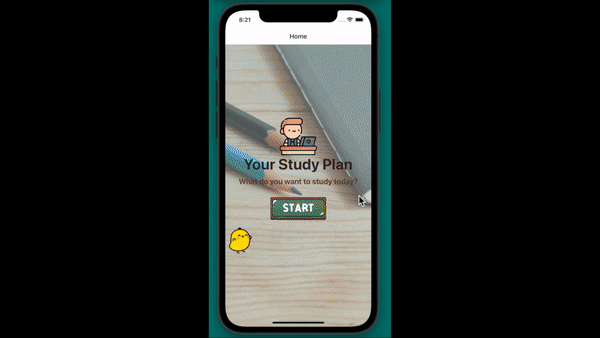

# Your Study Plan

## Description:

- This is a mobile App that allows users to add, duplicate, or delete their daily study plans using mobile gestures ux design. Each plan has a customized countdown timer that allows users to focus on their plan on a certain time.

## How to Use:

- fork this repo on your local machine
- run **expo start** on terminal, then follow the instruction to open the app in the way you prefer

## Demo:

## Tech Stacks:

- React Native / Expo

- react-navigation

- React

- react-native-gesture-handler

- SQLite
- expo-optimize

## Images Reference Links:

- <a href="https://www.flaticon.com/free-icons/cute" title="cute icons">Cute icons created by Smashicons - Flaticon</a>

- <a href="https://www.flaticon.com/free-icons/student" title="student icons">Student icons created by Freepik - Flaticon</a>

- <a href="https://www.flaticon.com/free-icons/timer" title="timer icons">Timer icons created by Freepik - Flaticon</a>

- <a href="https://www.flaticon.com/free-icons/study" title="study icons">Study icons created by Freepik - Flaticon</a>

- <a href="https://www.flaticon.com/free-icons/task" title="task icons">Task icons created by Freepik - Flaticon</a>

- <a href="https://www.flaticon.com/free-icons/congratulation" title="congratulation icons">Congratulation icons created by Freepik - Flaticon</a>

## Note:

This mobile app supports both IOS and Android systems. However, the left swipe does not support on Android system when testing on Android emulator.
